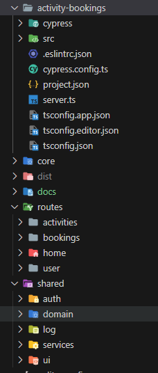

# NxLab

> [!NOTE]
> Angular with Nx Laboratory for courses and workshops by [Alberto Basalo](https://albertobasalo.dev)

This project was generated with [Nx CLI](https://nx.dev) version 17.2.6.

```bash
# clone lab from github
git clone https://github.com/AlbertoBasalo/nx-lab.git
# install and run
cd nx-lab
npm install
# start Angular server
npm start
```

## Documentation

Find detailed journal of instructions in [CLI.md](./docs/CLI.md)

### Folder structure

Have an outlook of the project folders structure



> [!TIP]
> Companion article (... wait until 231223)

## Testing

This project is being _e2e_ tested with **Cypress** and _unit_ tested with **Jest**.

```json
  "test": "nx run-many --target=test --all",
  "test:e2e": "nx e2e activity-bookings",
```

```bash
# run unit tests
npm run test
# run e2e tests
npm run test:e2e
```

[](https://albertobasalo.dev)

---

<footer>
  <h3>🧑🏼‍💻 By <a href="https://albertobasalo.dev" target="blank">Alberto Basalo</a> </h3>
  <p>
    <a href="https://twitter.com/albertobasalo" target="blank">
      
    </a>
  </p>
  <p>
    <a href="https://github.com/albertobasalo" target="blank">
      
    </a>
  </p>
</footer>
